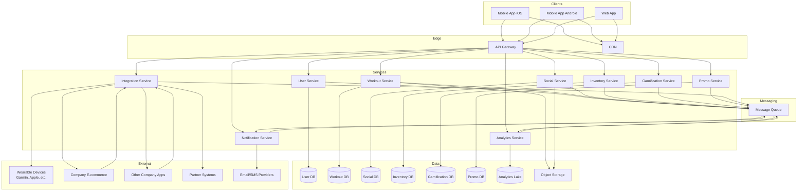

# 4. Концептуальная архитектура

## 4.1. Общая схема

На диаграмме ниже представлены основные компоненты системы и их взаимодействие. Архитектура построена по принципам микросервисов, что обеспечивает гибкость, масштабируемость и возможность независимой разработки различными командами.

## 4.2. Описание компонентов

### 4.2.1. Клиентские приложения
| Компонент | Назначение | Технологии |
|-----------|------------|------------|
| **Мобильное приложение iOS** | Основной интерфейс для пользователей iPhone. Использует нативные возможности: GPS, уведомления, датчики движения, HealthKit. | Swift, SwiftUI/UIKit, CoreLocation, HealthKit |
| **Мобильное приложение Android** | Основной интерфейс для устройств на Android. Аналогичный функционал с интеграцией Google Fit. | Kotlin, Jetpack Compose, Google Play Services, Google Fit API |
| **Веб-приложение** | Доступ через браузер для пользователей, предпочитающих десктоп, а также для административных панелей. | React/Vue.js, PWA |

### 4.2.2. Периферия (Edge)
| Компонент | Назначение | Технологии |
|-----------|------------|------------|
| **API Gateway** | Единая точка входа для всех клиентских запросов. Обеспечивает маршрутизацию, аутентификацию, rate limiting, агрегацию ответов, трансформацию протоколов. | Kong, Ambassador, AWS API Gateway, Nginx + Lua |
| **CDN** | Доставка статического контента (изображения профилей, загруженные медиа, файлы тренировок) с минимальной задержкой по всему миру. | Cloudflare, AWS CloudFront, Akamai |

### 4.2.3. Микросервисы (логика приложения)
| Сервис | Ответственность | Ключевые функции | Технологический стек |
|--------|-----------------|------------------|----------------------|
| **User Service** | Управление профилями, аутентификация, настройки приватности, согласия | Регистрация, профиль, управление друзьями, consent management, SSO | Java/Spring Boot, PostgreSQL, Redis (кэш), JWT |
| **Workout Service** | Тренировки, статистика, история, сравнения | Запись тренировок, GPS-треки, графики, личные рекорды, сравнение с регионом/профи | Python/FastAPI, PostgreSQL + PostGIS, TimescaleDB (для временных рядов), Object Storage (S3) для треков |
| **Social Service** | Группы по интересам, поиск людей, общение, лента активности | Создание групп, чаты, комментарии, лайки, поиск по локации/интересам | Node.js/Express, MongoDB (для сообщений), Neo4j (граф связей), Elasticsearch (поиск) |
| **Inventory Service** | Учёт спортивного инвентаря, износ, рекомендации | Добавление обуви/снарядов, подсчёт пробега, уведомления о замене | Go, PostgreSQL, Redis |
| **Gamification Service** | Геймификация, достижения, уровни, челленджи | Начисление опыта, значки, рейтинги, проведение соревнований | Python/Django, PostgreSQL, Redis (лидерборды) |
| **Promo Service** | Промоакции, новости спорта, персонализация | Таргетинг промо, интеграция с каталогом товаров, новостная лента | Java/Spring Boot, PostgreSQL, MongoDB (для контента), Kafka (события) |
| **Notification Service** | Отправка уведомлений (push, email, SMS) | Уведомления о тренировках, достижениях, промо, напоминания | Node.js, Firebase Cloud Messaging, Apple Push, Twilio, SendGrid, RabbitMQ |
| **Integration Service** | Взаимодействие с внешними системами | Подключение устройств (BLE/ANT+), синхронизация с HealthKit/Google Fit, интеграция с e-commerce и другими приложениями компании | Python/Node.js, Kafka, адаптеры под каждого партнёра |
| **Analytics Service** | Сбор событий, аналитика, отчёты | Логирование действий пользователей, подготовка данных для Data Lake, ETL процессы | Python, Kafka, ClickHouse, ETL (Airflow) |

### 4.2.4. Хранилища данных
| Тип хранилища | Технологии | Назначение |
|---------------|------------|------------|
| **Реляционные БД** | PostgreSQL, MySQL (с шардингом/кластеризацией) | User DB, Workout DB (частично), Inventory DB, Promo DB – для транзакционных данных с сильной согласованностью |
| **NoSQL** | MongoDB, Cassandra, Neo4j, Elasticsearch | Social DB (гибкая схема для сообщений, графы), Gamification DB (быстрые записи рейтингов), поисковый индекс |
| **Хранилища временных рядов** | TimescaleDB, InfluxDB | Workout DB для метрик тренировок (пульс, темп по времени) |
| **Аналитическое хранилище** | ClickHouse, Google BigQuery, Snowflake | Analytics Lake – долгосрочное хранение событий, агрегации, отчёты |
| **Объектное хранилище** | AWS S3, Google Cloud Storage, MinIO | Хранение загруженных файлов: фото профилей, GPX-треки, видео тренировок |
| **Кэш** | Redis, Memcached | Кэширование сессий, часто запрашиваемых данных, временные лидерборды |

### 4.2.5. Очереди сообщений
| Компонент | Технологии | Назначение |
|-----------|------------|------------|
| **Message Queue** | Apache Kafka, RabbitMQ, AWS SQS | Асинхронное взаимодействие между сервисами: уведомления, события для аналитики, обновление поисковых индексов, обработка фоновых задач |

### 4.2.6. Внешние интеграции
| Категория | Примеры систем | Назначение |
|-----------|----------------|------------|
| **Носимые устройства** | Garmin, Polar, Apple Watch, Fitbit, датчики по BLE/ANT+ | Получение данных тренировок, пульса, кислорода в реальном времени |
| **Фитнес-платформы ОС** | Apple HealthKit, Google Fit, Samsung Health | Импорт/экспорт активности, шагов, сна |
| **E-commerce компании** | Интернет-магазин компании | Получение каталога товаров, отправка событий для персонализации, переход в корзину |
| **Другие приложения компании** | Специализированные спортивные приложения | Единый вход (SSO), обмен данными о тренировках, синхронизация прогресса |
| **Партнёрские системы** | Спортивные клубы, тренерские платформы, новостные агентства | Размещение контента, программы тренировок, новости |
| **Провайдеры уведомлений** | Firebase Cloud Messaging, Apple Push Notification Service, Twilio, SendGrid | Доставка push, email и SMS-уведомлений |