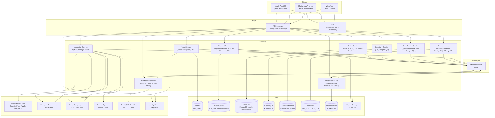

# 13. Базовая архитектура с учётом ограничений

## 13.1. Введение

Базовая архитектура развивает концептуальную схему (раздел 4), добавляя конкретные технологические решения и детали реализации, необходимые для удовлетворения нефункциональных требований (раздел 9) и атрибутов качества (раздел 8). Архитектура построена на принципах микросервисов, мультиоблачности, асинхронного взаимодействия и полиглотного хранения данных.

## 13.2. Уточнённая архитектурная схема

## 13.3. Описание компонентов и технологий

### 13.3.1. Клиентские приложения
- **iOS App**: Swift, SwiftUI/UIKit, интеграция с HealthKit, CoreLocation. Обеспечивает высокую производительность и доступ к нативным датчикам. Использует кэширование данных для офлайн-режима.
- **Android App**: Kotlin, Jetpack Compose, Google Fit API, Google Play Services. Аналогичный функционал.
- **Web App**: React, PWA для доступа с десктопов и мобильных браузеров. Поддержка офлайн через Service Workers.

### 13.3.2. Периферия
- **API Gateway (Kong / AWS API Gateway)**:
  - Маршрутизация запросов к соответствующим микросервисам.
  - Аутентификация и авторизация (проверка JWT, взаимодействие с Identity Provider).
  - Rate limiting для защиты от DDoS и обеспечения fair use.
  - Агрегация ответов (где необходимо) для уменьшения числа запросов с клиента.
  - Логирование запросов для наблюдаемости.
- **CDN (Cloudflare, AWS CloudFront)**:
  - Доставка статического контента (изображения, GPX-файлы, видео) с низкой задержкой.
  - Кэширование на граничных узлах, снижение нагрузки на объектное хранилище.

### 13.3.3. Микросервисы
| Сервис | Технологии | Обоснование выбора | Вклад в атрибуты качества |
|--------|------------|--------------------|---------------------------|
| **User Service** | Java/Spring Boot, PostgreSQL, Redis (кэш), JWT | Java обеспечивает стабильность и производительность; Spring Boot – быстрая разработка; PostgreSQL – ACID для профилей; Redis – кэширование сессий. | Масштабируемость (горизонтальное масштабирование stateless), безопасность (JWT, интеграция с Keycloak). |
| **Workout Service** | Python/FastAPI, PostgreSQL+PostGIS, TimescaleDB, S3 | FastAPI – высокая производительность для I/O-bound операций; PostGIS – работа с геоданными; TimescaleDB – эффективное хранение и запросы временных рядов (пульс, темп); S3 – для GPX-треков. | Масштабируемость (шардирование по пользователям), производительность (оптимизированные запросы к временным рядам). |
| **Social Service** | Node.js/Express, MongoDB, Neo4j, Elasticsearch | Node.js – хорош для I/O и real-time; MongoDB – гибкая схема для сообщений и ленты; Neo4j – графовая БД для связей друзей и групп; Elasticsearch – полнотекстовый поиск. | Масштабируемость (горизонтальное масштабирование, шардинг MongoDB), производительность поиска. |
| **Inventory Service** | Go, PostgreSQL | Go – высокая производительность и низкое потребление ресурсов; PostgreSQL – надёжность для учёта инвентаря. | Масштабируемость, низкая задержка. |
| **Gamification Service** | Python/Django, PostgreSQL, Redis | Django – быстрая разработка, админка; Redis – для лидербордов в реальном времени (sorted sets). | Производительность (in-memory лидерборды), масштабируемость (репликация Redis). |
| **Promo Service** | Java/Spring Boot, PostgreSQL, MongoDB | Java для надёжности; PostgreSQL – для транзакционных данных промо; MongoDB – для гибкого контента новостей и правил. | Масштабируемость, гибкость. |
| **Notification Service** | Node.js, Kafka, FCM, APNS, Twilio, SendGrid | Node.js – асинхронная обработка; Kafka – буферизация уведомлений; внешние провайдеры для доставки. | Надёжность (очереди, повторные попытки), масштабируемость (горизонтальное масштабирование consumer’ов). |
| **Integration Service** | Python/Node.js, Kafka, адаптеры | Унифицирует доступ к внешним системам; Kafka для событий; адаптеры под каждого партнёра. | Снижение связанности, отказоустойчивость (кэширование ответов, retry). |
| **Analytics Service** | Python, Kafka, ClickHouse, Airflow | ClickHouse – колоночная БД для быстрой аналитики; Kafka – сбор событий; Airflow – ETL задачи. | Производительность запросов, масштабируемость хранения. |

### 13.3.4. Хранилища данных
- **Реляционные БД (PostgreSQL)**: используются там, где важны ACID и сложные транзакции (User, Inventory, часть Promo). Кластеризация, репликация master-slave, шардинг по userId.
- **TimescaleDB**: расширение PostgreSQL для временных рядов (данные тренировок: пульс, темп по времени). Автоматическое партиционирование по времени, оптимизированные запросы.
- **MongoDB**: для Social Service (сообщения, лента активности). Шардинг по группам/пользователям.
- **Neo4j**: графовая БД для социального графа (друзья, группы). Эффективные запросы связей.
- **Elasticsearch**: поисковый движок для пользователей, групп, контента. Репликация, шардинг.
- **Redis**: in-memory для кэша (сессии, часто запрашиваемые данные) и лидербордов (sorted sets). Sentinal/Cluster для отказоустойчивости.
- **ClickHouse**: аналитическое хранилище для событий. Репликация, шардинг.
- **Объектное хранилище (S3, MinIO)**: для хранения файлов (GPX, фото). CDN для доставки.

### 13.3.5. Очереди сообщений (Kafka)
- Используется для асинхронной коммуникации между сервисами.
- Топики: `user-events`, `workout-events`, `notification-events`, `analytics-events` и т.д.
- Обеспечивает отказоустойчивость (репликация), масштабирование (партиционирование), гарантии доставки (at-least-once).

### 13.3.6. Внешние интеграции
- **Identity Provider (Keycloak)**: централизованная аутентификация, поддержка SSO, OAuth2, OpenID Connect. Интеграция с API Gateway.
- **Wearable Devices**: через BLE/ANT+ (мобильное приложение напрямую) или облачные API (Garmin, Polar) через Integration Service.
- **E-commerce компании**: REST API для каталога товаров, оформления заказа.
- **Другие приложения компании**: через Integration Service (обмен данными, SSO).
- **Партнёры**: новостные ленты, спортивные клубы – через API.
- **Email/SMS провайдеры**: SendGrid, Twilio.

## 13.4. Обеспечение атрибутов качества

### 13.4.1. Масштабируемость
- **Горизонтальное масштабирование микросервисов**: каждый сервис спроектирован stateless (кроме БД), может запускаться в нескольких экземплярах. Kubernetes HPA автоматически добавляет реплики при росте нагрузки.
- **Шардирование баз данных**: по userId или другому ключу для распределения нагрузки. Например, User DB шардирована по userId, Workout DB – по userId + временной шард.
- **Кэширование**: Redis для часто запрашиваемых данных (профили, лидерборды) снижает нагрузку на основные БД.
- **CDN**: разгружает объектное хранилище и ускоряет доставку контента пользователям по всему миру.
- **Асинхронность**: очереди сглаживают пиковые нагрузки (например, массовые уведомления во время челленджей).
- **Мультиоблачность**: возможность развернуть сервисы в разных регионах и у разных провайдеров, чтобы обслуживать локальных пользователей с низкой задержкой.

### 13.4.2. Безопасность и приватность
- **Аутентификация и авторизация**: все запросы к API проходят через API Gateway, который проверяет JWT, полученный от Keycloak. Keycloak поддерживает MFA, социальный вход, управление сессиями.
- **Шифрование**: TLS для всех внешних и внутренних коммуникаций; шифрование данных в покое (БД, объектное хранилище) с использованием AES-256.
- **Управление согласиями**: User Service хранит согласия пользователей на обработку данных; все сервисы проверяют согласия перед использованием данных для промо или аналитики.
- **Data residency**: возможность выбора региона для хранения данных при развёртывании (Kubernetes кластеры в разных облаках). Данные пользователей из EU хранятся только в EU.
- **Аудит доступа**: все обращения к PII логируются и доступны для проверки.
- **Защита от DDoS**: rate limiting на API Gateway, облачные защиты (AWS Shield, Cloudflare).

### 13.4.3. Наблюдаемость
- **Логирование**: все сервисы отправляют логи в централизованный стек (EFK: Elasticsearch, Fluentd, Kibana). Логи содержат correlation ID для трассировки запросов.
- **Метрики**: Prometheus собирает метрики с сервисов (количество запросов, ошибки, задержки). Grafana предоставляет дашборды для разработки, DevOps и бизнеса.
- **Трассировка**: Jaeger собирает распределённые трассы (сэмплирование 10% трафика), что позволяет выявлять узкие места и сбои.
- **Алерты**: на основе метрик настроены оповещения в PagerDuty/Slack о превышении порогов (высокая задержка, ошибки 5xx).

### 13.4.4. Надёжность и отказоустойчивость
- **Репликация БД**: master-slave, автоматический failover (Patroni для PostgreSQL, MongoDB Replica Set).
- **Резервное копирование**: ежедневные полные копии, инкрементальные каждые 5 минут (RPO <5 мин). Хранение в другом регионе.
- **Graceful degradation**: при недоступности Integration Service, сервисы используют кэшированные данные или возвращают сообщение о временной недоступности функции.
- **Retry и circuit breaker**: в сервисах реализованы паттерны повторных попыток и размыкания цепи при вызовах внешних систем.
- **Мультиоблачное развёртывание**: снижает риск полной недоступности при сбое одного провайдера.

## 13.5. Соответствие нефункциональным требованиям

| НФТ (раздел 9) | Как обеспечивается |
|----------------|---------------------|
| **9.1. Производительность** | Кэширование (Redis), индексы БД, шардинг, асинхронная обработка, CDN, оптимизированные API (gRPC для внутренних). |
| **9.2. Надёжность** | Репликация, резервное копирование, автоматическое восстановление, circuit breakers, очереди. |
| **9.3. Безопасность** | Keycloak, JWT, TLS, шифрование дисков, управление согласиями, аудит. |
| **9.4. Масштабируемость** | Горизонтальное масштабирование сервисов и БД, шардинг, автомасштабирование, Kafka. |
| **9.5. Наблюдаемость** | EFK, Prometheus/Grafana, Jaeger, алерты. |
| **9.6. Удобство сопровождения** | Микросервисы, чёткие API, документация OpenAPI, CI/CD, единые стандарты. |
| **9.7. Интернационализация** | Файлы переводов, локализация на стороне клиента, поддержка региональных форматов. |
| **9.8. Соответствие регуляциям** | Data residency, consent management, удаление данных, аудит. |
| **9.9. Совместимость** | Поддержка стандартов (HealthKit, Google Fit, BLE, ANT+), тестирование на различных устройствах. |
| **9.10. Требования к данным и хранению** | Резервное копирование, TTL для логов, региональное хранение. |
| **9.11. Юзабилити** | UX-исследования, доступность (WCAG), адаптивный дизайн. |

## 13.6. Ограничения и компромиссы

- **Eventual consistency**: из-за асинхронности и очередей данные могут быть не сразу согласованы (например, обновление инвентаря после тренировки может занять несколько секунд). Для большинства сценариев это приемлемо.
- **Сложность мультиоблачности**: управление несколькими облаками требует дополнительных усилий от DevOps, возможны задержки межоблачного трафика. Компенсируется использованием Kubernetes и унифицированных инструментов (Terraform, Helm).
- **Затраты на инфраструктуру**: полиглотное хранение и множественные сервисы увеличивают стоимость по сравнению с монолитом. Однако это окупается масштабируемостью и скоростью разработки.
- **Сложность тестирования распределённых систем**: требуются интеграционные тесты, контрактное тестирование, тестовые окружения, приближенные к production.

Архитектура спроектирована так, чтобы балансировать между этими компромиссами, обеспечивая достижение бизнес-целей и атрибутов качества.