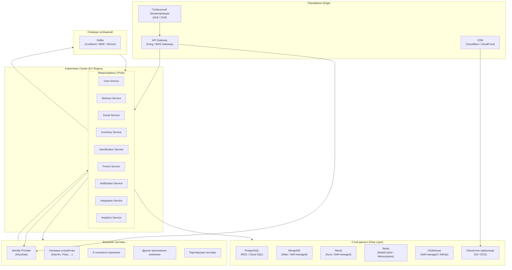

# Инфраструктурное представление

## Мультиоблачная стратегия

Система развёртывается в нескольких облачных провайдерах (AWS, Google Cloud Platform) для обеспечения глобальной доступности, соблюдения требований к хранению данных (data residency) и снижения рисков vendor lock-in. Управление инфраструктурой осуществляется через Terraform, оркестрация – Kubernetes (k8s).

## Схема развёртывания (на примере региона EU)

## Сетевые взаимодействия

- **Внешние запросы**: клиенты → CDN (статический контент) → глобальный балансировщик → API Gateway (публичная подсеть).
- **Внутренние вызовы**: API Gateway → сервисы внутри кластера через внутренние сервисы Kubernetes (ClusterIP). Для межсервисного взаимодействия используется сервис-меш (Istio или Linkerd) для обеспечения mTLS, трассировки и контроля трафика.
- **Доступ к БД**: сервисы подключаются к управляемым БД через приватные эндпоинты (VPC).
- **Межоблачное взаимодействие**: если сервисы из разных облаков должны общаться, используется VPN-соединение (Cloud VPN / AWS Direct Connect) или публичные API с шифрованием.

## Отказоустойчивость

- **Мультизональность**: каждый кластер Kubernetes развёрнут в нескольких availability zones.
- **Репликация БД**: master-slave с автоматическим failover.
- **Резервное копирование**: ежедневные snapshots БД и объектного хранилища в другой регион.
- **Disaster Recovery**: план восстановления (RTO 4 часа, RPO 5 мин) с возможностью развёртывания всего стека в другом регионе с помощью Terraform.

## Мониторинг и логирование

- **Метрики**: Prometheus (pull) + Grafana. Метрики собираются с каждого пода, БД, Kafka.
- **Логи**: Fluentd собирает логи с подов → Elasticsearch → Kibana.
- **Трассировка**: Jaeger (через Istio или агенты).

## Инфраструктура как код (IaC)

- **Terraform**: управление облачными ресурсами (сети, managed services).
- **Helm**: упаковка и развёртывание микросервисов.
- **ArgoCD**: GitOps для непрерывной доставки.